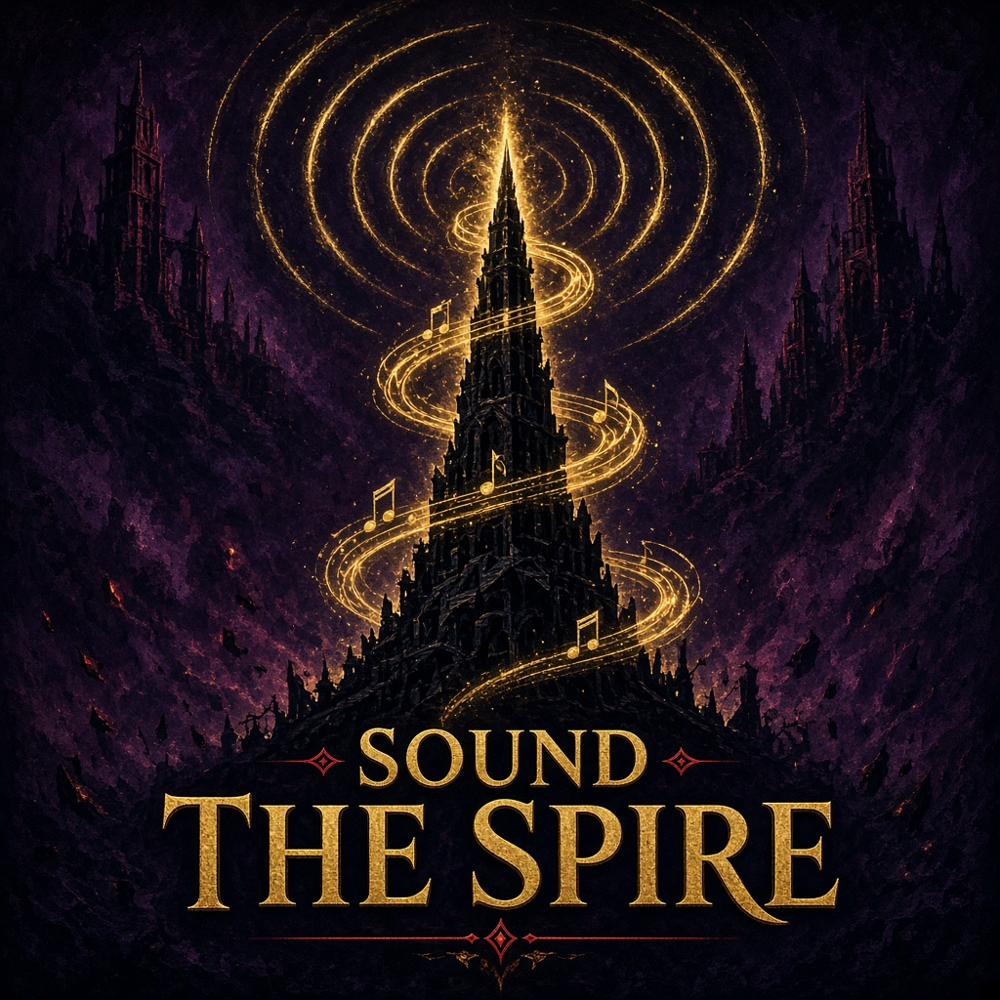

<p align="center"></p>

# Sound the Spire

用耳朵玩《杀戮尖塔 2》：把战斗信息变成音乐，敌人要做什么、你挡不挡得住，都能听出来。不是朗读，是音乐。

Play Slay the Spire 2 by ear: enemy intents and whether your defense holds become music, not text-to-speech.

## 安装 / Install

**一键安装（推荐）**：打开 PowerShell，粘贴运行：

```powershell
irm https://raw.githubusercontent.com/MuGdxy/SoundTheSpire/main/scripts/install.ps1 | iex
```

它会自动找到游戏、下载[最新发布](https://github.com/MuGdxy/SoundTheSpire/releases/latest)并装进 `mods\SoundTheSpire`；以后再运行一次就是更新。
也可以在[发布页](https://github.com/MuGdxy/SoundTheSpire/releases/latest)下载 `install.bat` 双击运行，效果相同。

**卸载**：在 PowerShell 粘贴运行（或在[发布页](https://github.com/MuGdxy/SoundTheSpire/releases/latest)下载 `uninstall.bat` 双击）：

```powershell
irm https://raw.githubusercontent.com/MuGdxy/SoundTheSpire/main/scripts/uninstall.ps1 | iex
```

它删除游戏目录下的 `mods\SoundTheSpire`。通过创意工坊订阅的，在 Steam 里取消订阅即可。

**手动安装**：从发布页下载 `SoundTheSpire-<版本>.zip`，把里面的 `SoundTheSpire` 文件夹放进游戏目录的 `mods` 文件夹（没有就新建），变成 `Slay the Spire 2\mods\SoundTheSpire\SoundTheSpire.dll`。

开模组时游戏使用单独的存档，原来的进度不受影响。联机时所有玩家都要装同一个版本。

## 按键 / Keys

| 按键 | 作用 |
| --- | --- |
| R | 重听本回合汇总 |
| F9 | 开 / 关训练遮罩（看见数值、意图） |
| F8 | 声音测试 |

鼠标移到某只怪身上，单独听它的意图；移到自己的角色身上，重听当前防御端状态。第一次玩建议在主菜单中央点"声音教学关"：它会开一局独立、不存档的新局并直接进入教学关。正常游戏局内不能进入；打赢后直接回到主菜单。

声音设置里有独立的 **Sound the Spire 乐段音量**：范围 0–400%，新安装默认 100%。各曲 Profile 会补偿 SoundFont 与原曲的基础响度差；该滑块用于个人微调。

## 致谢 / Credits

- 音色：[GeneralUser GS](https://schristiancollins.com/generaluser.php) SoundFont（S. Christian Collins）
- 合成：[MeltySynth](https://github.com/sinshu/meltysynth)（MIT）
